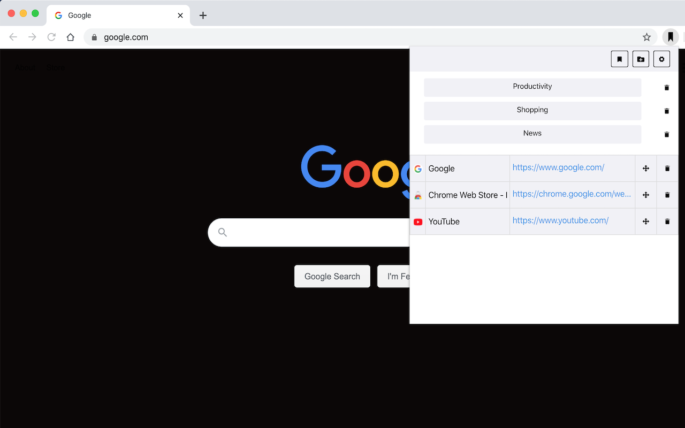
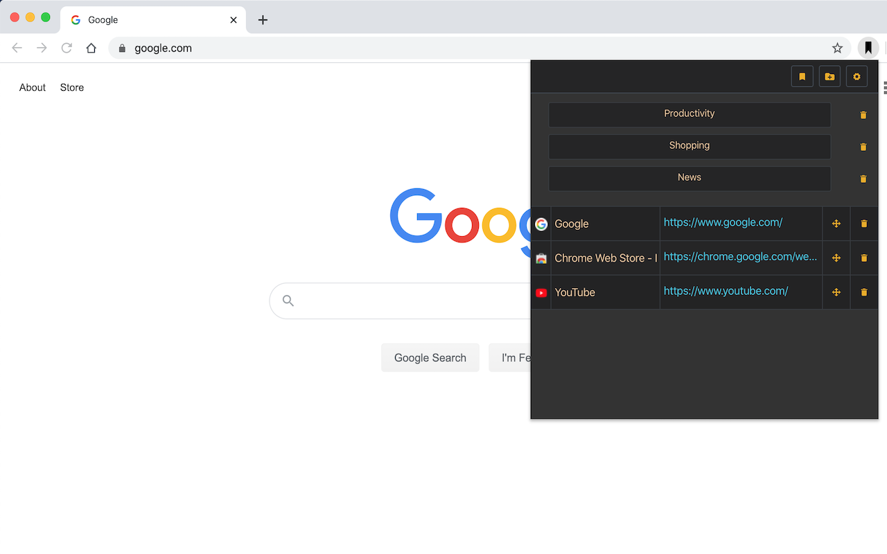

# Kolitiri Bookmarks Extension for Chrome

This is a chrome extension for managing bookmarks. It offers a number of options including:
* Add bookmarks and organize them in folders
* Import bookmarks from chrome bar
* Import bookmarks from a .json file (previously exported by the extension)
* Export bookmarks to a .json file
* Toggle dark mode

### Technologies used

The extension is a regular [reactJS](https://reactjs.org/) app that is using [Bootstrap 4](https://getbootstrap.com/docs/4.0/getting-started/introduction/) to stylish the UI components and [Chrome Extensions API](https://developer.chrome.com/extensions/api_index) to access and manipulate the bookmarks.

### Installation

You can install [Kolitiri Bookmarks](https://chrome.google.com/webstore/detail/kolitiri-bookmarks/hfnmppffaaifkdapbbnjlbeeefjdhjdm) from the chrome web store.

Alternatively, you can build the project using the Makefile and load it as an unpacked extension.

### Supported browsers

Well, only chrome for now.

### Todo

1. Update Makefile. Add options for:
* Installing the app and its dependencies,
* Building the app locally,
* Compiling schema.json

2. Fix bug related to moving bookmarks from the root directory to child folders

### Authors

Chris Liontos
